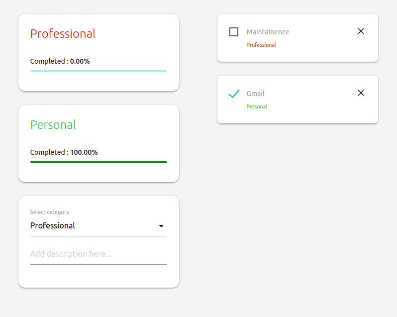

## Redux hooks
Simple todo app written purely using react hooks and redux

<br/>

### Live demo
https://accelerator-one.github.io/redux-hooks/

<br/>

### Screenshots


<br/>

### Usage
- Clone the repository
  ```bash
  git clone https://github.com/Accelerator-One/redux-hooks.git
  ```

- Install npm dependencies
  ```bash
  npm install
  ```

- Running the build locally
  ```bash
  npm start
  ```

- Generating production build
  ```bash
  npm run build
  ```

- Generating component documentation
  ```bash
  npm run docs
  ```

<br/>

### Issues
In case of any issues faced with the codebase, mark them under *Issues* section of this repository
